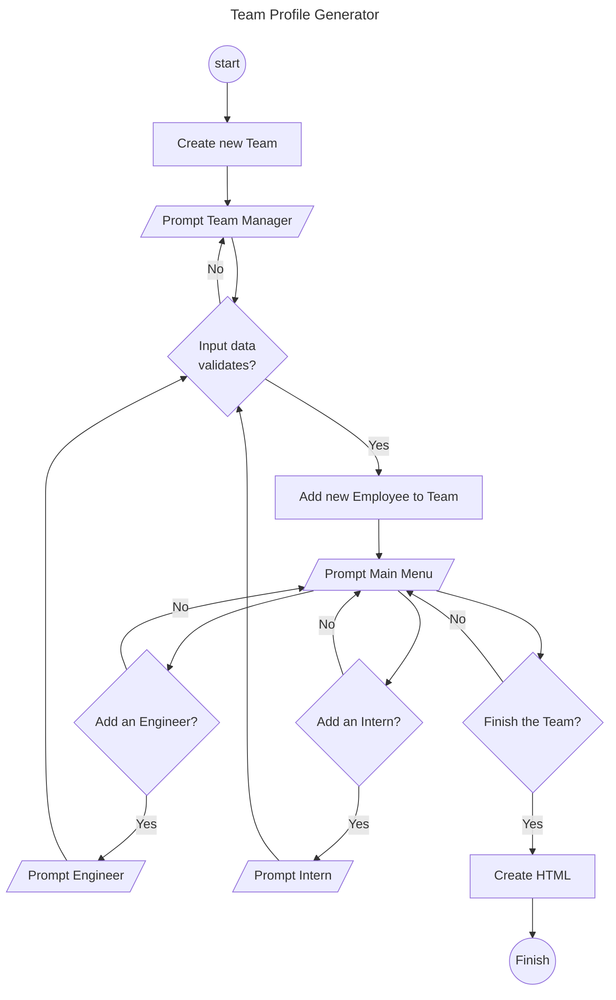
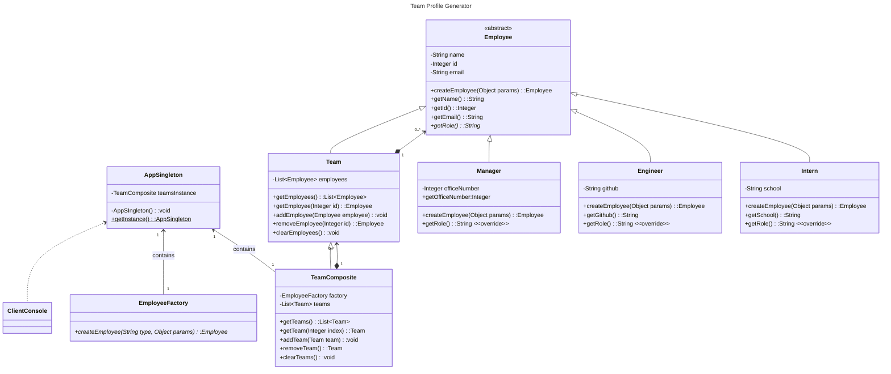
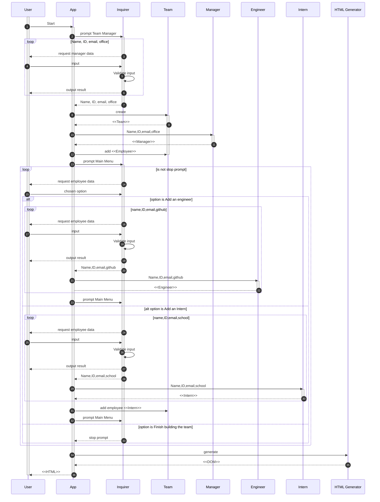

# Test-Driven Development: Team Profile Generator

A Node.js CLI application that will take in information about employees on a software engineering team, then generates an HTML webpage that displays summaries for each person, following Agile methodology and TDD development process.

<!-- project repository shields -->
<p align="center">
  
  
  
  
</p>

<p align="center">
  
  
  
  
  
  
  
  
</p>
<!-- end project repository shields -->

## Table of contents

- [Test-Driven Development: Team Profile Generator](#test-driven-development-team-profile-generator)
  - [Table of contents](#table-of-contents)
  - [Overview](#overview)
    - [The challenge](#the-challenge)
      - [Getting Started](#getting-started)
    - [Walkthough \& Screenshots](#walkthough--screenshots)
    - [Links](#links)
  - [My process](#my-process)
    - [Built with](#built-with)
    - [Flowchart Diagram (Simplified)](#flowchart-diagram-simplified)
    - [Class Diagram](#class-diagram)
    - [Sequence Diagram](#sequence-diagram)
    - [UX/UI Design](#uxui-design)
      - [Terminal Theming](#terminal-theming)
        - [Terminal Text Art Intro](#terminal-text-art-intro)
      - [Team Profile Page](#team-profile-page)
    - [Test Coverage](#test-coverage)
    - [What I learned](#what-i-learned)
    - [Continued development](#continued-development)
    - [Useful resources](#useful-resources)
  - [Author](#author)
  - [Acknowledgments](#acknowledgments)

## Overview

In this Challenge, you'll create an application that generates HTML files using input from a command-line interface.

### The challenge

Your task is to take the given starter code and convert it into a working Node.js command-line application. This application will take in information about employees on a software engineering team, then generate an HTML webpage that displays summaries for each person. You have been provided with tests, so make sure every part of your code passes each provided test.

#### Getting Started

Your application should use JestLinks to an external site. for running unit tests and InquirerLinks to an external site. for collecting input from the user. The application will be invoked by using the following command:

```node
node index.mjs
```

> 👆 Please note the `index.mjs` extension above. This is because the project has been developed using **ES6 modules** and no **CommonJS** syntax.

### Walkthough & Screenshots


_Click on each screenshot to take you to the Walkthrough video, a Team Profile's live example, and an example in PDF version._

**Walkthrough Video**
https://user-images.githubusercontent.com/2573750/222523833-77af7fda-d324-4848-b360-2ecda53db25e.mp4

[](https://technoveltyco.github.io/bootcamp-week12-challenge/)


[](https://technoveltyco.github.io/bootcamp-week12-challenge/output/My%20Team.pdf)


### Links

- Solution URL: [https://github.com/technoveltyco/bootcamp-week12-challenge](https://github.com/technoveltyco/bootcamp-week12-challenge)
- Live Site URL: [https://technoveltyco.github.io/bootcamp-week12-challenge/](https://technoveltyco.github.io/bootcamp-week12-challenge/)
- KANBAN Dashboard: [https://github.com/users/technoveltyco/projects/6](https://github.com/users/technoveltyco/projects/6)

## My process

I started designing the structure of the program by creating a [Flowchart Diagram](#flowchart-diagram-simplified), [Class Diagram](#class-diagram) and [Sequence Diagram](#sequence-diagram), so I could have a reference of the logic structure, modules and overall idea of the automated tests coverage required. Finally, I went through the ideas and doing investigation for the [UX/UI Design](#uxui-design), starting from the terminal theming, and following with the webpage design creating a visualisation on screens and a printer-friendly version.

### Built with

- Semantic HTML5 markup
- [CSS custom properties](https://github.com/technoveltyco/bootcamp-week12-challenge/blob/main/assets/css/style.css)
- Flexbox
- CSS Grid
- [Mobile-first workflow](https://github.com/technoveltyco/bootcamp-week12-challenge/blob/main/assets/css/style.css#L36)
- [Boostrap 4](https://getbootstrap.com/docs/4.0/getting-started/introduction/)
- [Node.js](https://nodejs.org/en/)
  - [Archiver](https://www.npmjs.com/package/archiver)
  - [Chalk](https://www.npmjs.com/package/chalk)
  - [Inquirer](https://www.npmjs.com/package/inquirer)
  - [Jest.js](https://jestjs.io/)
- [Mermaid](https://mermaid.js.org/)

### Flowchart Diagram (Simplified)



### Class Diagram



I extended the original models to include a more scalable architecture using the following [design patterns](https://en.wikipedia.org/wiki/Design_Patterns):

- [Singleton](https://en.wikipedia.org/wiki/Singleton_pattern): the App class implements this pattern to restrict the creation of more than one instance in our application. This is the main entry point in the application flow, and handles more of the errors and recovery states of the program flow.
- **Factory:** _due to JavaScript limitations for creating abstract classes and interfaces, the implementation of classical OO factory patterns are usually achieved by using [functional patterns](https://www.javascripttutorial.net/javascript-factory-functions/)_. However, a mixed implementation between the [Abstract factory pattern](https://en.wikipedia.org/wiki/Abstract_factory_pattern) and [Factory method pattern](https://en.wikipedia.org/wiki/Factory_method_pattern) was used to achieve flexibility in the design and allow the creation of model classes using 3 different approaches:

```js
  ///
  // Examples of different ways to initialise employees/manager/engineer/intern.
  // ------------------------------------------------------------------------------
  // - With constructor:
  // const employee = new Employee(...data);
  // - With factory method:
  // const employee = Employee.createEmployee(...data);
  // - With factory abstract class method: (the one used here)
  // const employee = EmployeeFactory.createEmployee("manager", ...data);
```

- [Composite](https://en.wikipedia.org/wiki/Composite_pattern): used for the container classes that store multiple instances of the model object, and allowing to create and control higher level data structures like: **team of employees**, and **list of teams**. By adding these structures, it also required to extend the test suite to check the correct integration of the data structures and ensure that the desired access restrictions to the data would be accomplished.

### Sequence Diagram



### UX/UI Design

A definition of colors and formatting of the output were created in a specific [CLI module](https://github.com/technoveltyco/bootcamp-week12-challenge/blob/main/src/utils/cli-theme.mjs) providing different utilities and helper functions.

#### Terminal Theming

| Emoji | Text Color | Background Color | Text decoration | Behaviour      | Terminal UI |
|-------|------------|------------------|-----------------|----------------|-------------|
| ✔️    | `#008000`  | `#000000`        | --              | Success        | --          |
| ✔️    | `#000000`  | `#00ffff`        | --              | Done           | --          |
| ⚠️    | `#ffa500`  | `#000000`        | --              | Warning        | --          |
| --    | `#ffa500`  | `#000000`        | --              | Fail validate   | --          |
| ⚠️    | `#000000`  | `#00ffff`        | --              | Info           | Bottom Bar  |
| ❌    | `#ff0000`  | `#000000`        | --              | Fatal Error    | Bottom Bar  |
| 📂    | `#ffffff`  | `#000000`        | --              | Created        | --          |
| 🙏    | `#ffffff`  | `#000000`        | --              | Thanks         | --           |
| --    | `#ffffff`  | `#000000`        | **Bold**        | Label          | --           |
| --    | `#000000`  | `#00ffff`        | --              | Highlight      | --           |
|       | `#000000`  | `#00ffff`        | --              | Notify         | Bottom Bar   |
| 📛    | `#ffffff`  | `#000000`        | **Bold**        | Name Input Label | --           |
| 🆔    | `#ffffff`  | `#000000`        | **Bold**        | ID Input Label | --           |
| 📧    | `#ffffff`  | `#000000`        | **Bold**        | Email Input Label | --           |
| 🏢    | `#ffffff`  | `#000000`        | **Bold**        | Office Number Input Label | --           |
| 💻    | `#ffffff`  | `#000000`        | **Bold**        | GitHub Account Input Label | --           |
| 🏫    | `#ffffff`  | `#000000`        | **Bold**        | School Input Label | --           |
| --    | `#ffffff`  | `#000000`        | --              | Default text       | --          |

##### Terminal Text Art Intro

_This cover intro was created but still not implemented in v1.0._

```text
 ███████████                                       ███████████                        ██████   ███  ████                █████████                                                    █████                      
░█░░░███░░░█                                      ░░███░░░░░███                      ███░░███ ░░░  ░░███               ███░░░░░███                                                  ░░███                       
░   ░███  ░   ██████   ██████   █████████████      ░███    ░███ ████████   ██████   ░███ ░░░  ████  ░███   ██████     ███     ░░░   ██████  ████████    ██████  ████████   ██████   ███████    ██████  ████████ 
    ░███     ███░░███ ░░░░░███ ░░███░░███░░███     ░██████████ ░░███░░███ ███░░███ ███████   ░░███  ░███  ███░░███   ░███          ███░░███░░███░░███  ███░░███░░███░░███ ░░░░░███ ░░░███░    ███░░███░░███░░███
    ░███    ░███████   ███████  ░███ ░███ ░███     ░███░░░░░░   ░███ ░░░ ░███ ░███░░░███░     ░███  ░███ ░███████    ░███    █████░███████  ░███ ░███ ░███████  ░███ ░░░   ███████   ░███    ░███ ░███ ░███ ░░░ 
    ░███    ░███░░░   ███░░███  ░███ ░███ ░███     ░███         ░███     ░███ ░███  ░███      ░███  ░███ ░███░░░     ░░███  ░░███ ░███░░░   ░███ ░███ ░███░░░   ░███      ███░░███   ░███ ███░███ ░███ ░███     
    █████   ░░██████ ░░████████ █████░███ █████    █████        █████    ░░██████   █████     █████ █████░░██████     ░░█████████ ░░██████  ████ █████░░██████  █████    ░░████████  ░░█████ ░░██████  █████    
   ░░░░░     ░░░░░░   ░░░░░░░░ ░░░░░ ░░░ ░░░░░    ░░░░░        ░░░░░      ░░░░░░   ░░░░░     ░░░░░ ░░░░░  ░░░░░░       ░░░░░░░░░   ░░░░░░  ░░░░ ░░░░░  ░░░░░░  ░░░░░      ░░░░░░░░    ░░░░░   ░░░░░░  ░░░░░     
                                                                                                                                                                                                                
                                                                                                                                                                                                                
                                                                                                                                                                                                                
              ,  ,                                                           █████                
             / \/ \,'| _                                                    ░░███                
            ,'    '  ,' |,|                                                  ░███████  █████ ████
           ,'           ' |,'|                                               ░███░░███░░███ ░███ 
          ,'                 ;'| _                                           ░███ ░███ ░███ ░███ 
         ,'                    '' |                                          ░███ ░███ ░███ ░███ 
        ,'                        ;-,                                        ████████  ░░███████ 
       (___                        /                                        ░░░░░░░░    ░░░░░███ 
     ,'    `.  ___               ,'                                                     ███ ░███ 
    :       ,`'   `-.           /                                                      ░░██████  
    |-._ o /         \         /                                                        ░░░░░░   
   (    `-(           )       /
  ,'`.     \      o  /      ,'
 /    `     `.     ,'      /
(             `"""'       /              ███████████                   █████                                               ████   █████               
 `._                     /              ░█░░░███░░░█                  ░░███                                               ░░███  ░░███                
    `--.______        '"`.              ░   ░███  ░   ██████   ██████  ░███████   ████████    ██████  █████ █████  ██████  ░███  ███████   █████ ████ 
       \__,__,`---._   '`;                  ░███     ███░░███ ███░░███ ░███░░███ ░░███░░███  ███░░███░░███ ░░███  ███░░███ ░███ ░░░███░   ░░███ ░███  
            ))`-^--')`,-'                   ░███    ░███████ ░███ ░░░  ░███ ░███  ░███ ░███ ░███ ░███ ░███  ░███ ░███████  ░███   ░███     ░███ ░███  
          ,',_____,'  |                     ░███    ░███░░░  ░███  ███ ░███ ░███  ░███ ░███ ░███ ░███ ░░███ ███  ░███░░░   ░███   ░███ ███ ░███ ░███  
          \_          `).                   █████   ░░██████ ░░██████  ████ █████ ████ █████░░██████   ░░█████   ░░██████  █████  ░░█████  ░░███████  
            `.      _,'  `                 ░░░░░     ░░░░░░   ░░░░░░  ░░░░ ░░░░░ ░░░░ ░░░░░  ░░░░░░     ░░░░░     ░░░░░░  ░░░░░    ░░░░░    ░░░░░███  
            /`-._,-'      \                                                                                                                 ███ ░███                                                                                                                                                                                                                 
                                                                                                                                            ░░██████                                                                                                                                                                                         
                                                                                                                                             ░░░░░░                                                                                                                                                                             

```

#### Team Profile Page

The theming was inpired in the idea of practising UI design shapes using CSS effects and vectorised images in SVG format. In addition for usability considerations, a printer-friendly theme was created too.

To look at the sample of a generated Team Profile follow the links below:

- [HTML format](https://technoveltyco.github.io/bootcamp-week12-challenge/)
- [PDF format](https://technoveltyco.github.io/bootcamp-week12-challenge/output/My%20Team.pdf) (printer-friendly version)

### Test Coverage

Tests were created for all the models implemented in the diagram of classes, covering ~100% of the code.

You can run the tests from the project root folder using `npm run test`.

### What I learned

Use this section to recap over some of your major learnings while working through this project. Writing these out and providing code samples of areas you want to highlight is a great way to reinforce your own knowledge.

To see how you can add code snippets, see below:

```html
<h1>Some HTML code I'm proud of</h1>
```

```css
.proud-of-this-css {
  color: papayawhip;
}
```

```js
const proudOfThisFunc = () => {
  console.log("🎉");
};
```

### Continued development

The following tickets has been created for future development:

- Bug fixes & Improvements
- Functional tests for the document generation.
- Remote Terminal & Security implications
- Landing page
- Docs page

### Useful resources

- JavaScript
  - MDN
    - [Classes](https://developer.mozilla.org/en-US/docs/Web/JavaScript/Reference/Classes)
    - [super](https://developer.mozilla.org/en-US/docs/Web/JavaScript/Reference/Operators/super)
    - [Private class features](https://developer.mozilla.org/en-US/docs/Web/JavaScript/Reference/Classes/Private_class_fields)
    - [Simulating private constructors](https://developer.mozilla.org/en-US/docs/Web/JavaScript/Reference/Classes/Private_class_fields#simulating_private_constructors) - This section of the document was particularly helpful to implement the Singleton pattern non being constructable.
    - [static](https://developer.mozilla.org/en-US/docs/Web/JavaScript/Reference/Classes/static)
    - [Object](https://developer.mozilla.org/en-US/docs/Web/JavaScript/Reference/Global_Objects/Object)
    - [Working with objects](https://developer.mozilla.org/en-US/docs/Web/JavaScript/Guide/Working_with_Objects)
    - [Iterators and generators](https://developer.mozilla.org/en-US/docs/Web/JavaScript/Guide/Iterators_and_Generators)
    - [Symbol.iterator](https://developer.mozilla.org/en-US/docs/Web/JavaScript/Reference/Global_Objects/Symbol/iterator) - implemented in composite to handle the list of object containers.
    - [Iteration protocols](https://developer.mozilla.org/en-US/docs/Web/JavaScript/Reference/Iteration_protocols)
    - [Optional chaining (?.)](https://developer.mozilla.org/en-US/docs/Web/JavaScript/Reference/Operators/Optional_chaining)
    - [RegExp](https://developer.mozilla.org/en-US/docs/Web/JavaScript/Reference/Global_Objects/RegExp)
  - [Object-oriented JavaScript: A Deep Dive into ES6 Classes](https://www.sitepoint.com/object-oriented-javascript-deep-dive-es6-classes/)
  - [Classes in JS: Public, Private and Protected](https://dev.to/bhagatparwinder/classes-in-js-public-private-and-protected-1lok)
  - [Quick Guide to using interfaces with JavaScript](https://medium.com/@_kamerontanseli/quick-guide-to-using-interfaces-with-javascript-5a557f635e11)
  - [Interfaces in JavaScript with ES6 Symbol. Naive implementation](https://codeburst.io/interfaces-in-javascript-with-es6-naive-implementation-91b703110a09)
  - [Factory Design Pattern](https://pragmaticways.com/factory-design-pattern/)
  - [JavaScript Object Oriented Patterns: Factory Pattern](https://www.digitalocean.com/community/tutorials/js-factory-pattern)
  - [JS ES6 Design Patterns: Factory](https://dev.to/sanderdebr/js-es6-design-patterns-factory-3a3g)
  - [JavaScript Factory Method](https://www.dofactory.com/javascript/design-patterns/factory-method)
  - [Class, Factory, and Object Prototypes in JavaScript](https://javascript.plainenglish.io/class-factory-and-object-prototypes-b4a7fff7dba8)
  - [Class vs Factory function: exploring the way forward](https://www.freecodecamp.org/news/class-vs-factory-function-exploring-the-way-forward-73258b6a8d15/)
  - [2 Ways to Implement Abstract Factory Pattern in JavaScript](https://itnext.io/2-ways-to-implement-abstract-factory-pattern-in-javascript-85f151bd5cbe)
  - [4 Ways to Implement Factory Pattern in JavaScript](https://itnext.io/4-ways-to-implement-factory-pattern-in-javascript-2e019c2a9ada)
  - [The 7 Most Useful Design Patterns in ES6 (and how you can implement them)](https://www.velotio.com/engineering-blog/design-patterns-in-es6)
  - [JavaScript Design Patterns: The Singleton](https://www.sitepoint.com/javascript-design-patterns-singleton/)
  - [How to Implement the Singleton Pattern in JavaScript ES6+](https://code.tutsplus.com/tutorials/how-to-implement-the-singleton-pattern-in-javascript-es6--cms-39927)
  - [Singletons in ES6 - The Good, The Bad, The Ugly](https://blog.boot.dev/clean-code/singletons-in-es6-the-good-the-bad-the-ugly/)
  - [Singletons in JavaScript](https://bretcameron.medium.com/singletons-in-javascript-59655927b7d7)
  - [How to Implement the Singleton Pattern in JavaScript ES6 +](https://localbizwebsitedesign.com/how-to-implement-the-singleton-pattern-in-javascript-es6/)
  - [Singleton Pattern in ES6 and ES7](https://www.adam-bien.com/roller/abien/entry/singleton_pattern_in_es6_and)
  - [Named function parameters in ES6](https://jonathanland.design/articles/named-function-parameters-in-es6/)
  - [Deep Equality checking of Objects in Vanilla JavaScript](https://dev.to/sanderdebr/deep-equality-checking-of-objects-in-vanilla-javascript-5592)
  - [Object references and copying](https://javascript.info/object-copy)
  - [Demystifying ES6 Iterables & Iterators](https://www.freecodecamp.org/news/demystifying-es6-iterables-iterators-4bdd0b084082/)
  - [JavaScript - Creating Custom Iterable by applying ES6 Iterable and Iterator Protocols](https://www.logicbig.com/tutorials/misc/javascript/custom-iterable.html)
  - [9 Ways to Remove Elements From A JavaScript Array - Plus How to Safely Clear JavaScript Arrays](https://love2dev.com/blog/javascript-remove-from-array/)
  - [A Practical guide to ES6 modules](https://www.freecodecamp.org/news/how-to-use-es6-modules-and-why-theyre-important-a9b20b480773/)
  - [Email Validation: Regex & JavaScript](https://www.abstractapi.com/guides/email-validation-regex-javascript)
- TDD
  - Jest
    - [Jest cheatsheet](https://devhints.io/jest)
    - [Setup and Teardown](https://jestjs.io/docs/setup-teardown)
    - [Using Matchers](https://jestjs.io/docs/using-matchers)
    - [Expect](https://jestjs.io/docs/expect)
    - [Mock Functions](https://jestjs.io/docs/mock-functions)
    - [The 4 ways to create an ES6 class mock](https://jestjs.io/docs/es6-class-mocks#the-4-ways-to-create-an-es6-class-mock)
    - [Testing Asynchronous Code](https://jestjs.io/docs/asynchronous)
    - [How to test the type of a thrown exception in Jest](https://stackoverflow.com/questions/46042613/how-to-test-the-type-of-a-thrown-exception-in-jest#46155381)
  - [A Beginner's Guide to Unit-testing with Jest](https://dev.to/dsasse07/a-beginner-s-guide-to-unit-testing-with-jest-45cc)
  - [Unit Testing with Jest](https://medium.com/dlt-labs-publication/unit-testing-with-jest-8da4f3cdb687)
  - [How to write unit tests in JavaScript with Jest](https://dev.to/dstrekelj/how-to-write-unit-tests-in-javascript-with-jest-2e83)
  - [How to test classes with Jest](https://dev.to/dstrekelj/how-to-test-classes-with-jest-jif)
  - [Write Tests That Tell a Story](https://medium.com/javarevisited/write-tests-that-tell-a-story-19404152fb62)
  - [Unit Testing of React Apps using JEST : Tutorial](https://www.browserstack.com/guide/unit-testing-of-react-apps-using-jest)
  - [Black-Box Testing: The Category-Partition Method](https://coursys.sfu.ca/2021fa-cmpt-275-e1/pages/CategoryPartition)
  - [Software Development Process: Part 3 of 3](https://www.youtube.com/playlist?list=PLAwxTw4SYaPkoQFThzsc9e7Fe3QV_KJCs)
  - [Category Partition Demo - Georgia Tech - Software Development Process](https://www.youtube.com/watch?v=zico2p-Ws2Y)
  - [11 API Testing Interview Questions (and Answers) to Help You Prepare For Your Next Interview](https://www.codecademy.com/resources/blog/api-testing-interview-questions-and-answers/)
  - [Debugging: the biggest waste](https://craftbettersoftware.com/p/debugging-the-biggest-waste)
- Node.js
  - [How to fix "__dirname is not defined in ES module scope"](https://flaviocopes.com/fix-dirname-not-defined-es-module-scope/)
  - [ReferenceError: __dirname is not defined in ES module scope](https://stackoverflow.com/questions/72456535/referenceerror-dirname-is-not-defined-in-es-module-scope)
  - [Node.js File Paths](https://nodejs.dev/en/learn/nodejs-file-paths/)
  - [Modules: ECMAScript modules](https://nodejs.org/api/esm.html#esm_enabling)
  - [Determining module system](https://nodejs.org/api/packages.html#determining-module-system)
  - [ascii-themes - Node.js CLI Interface to Generate VSCode Themed ASCII Art](https://dev.to/lakatos88/ascii-themes-node-js-cli-interface-to-generate-themed-ascii-art-4ck8)
  - [Animate the text in your terminal](https://codegolf.stackexchange.com/questions/109897/animate-the-text-in-your-terminal)
  - [Using console colors with Node.js](https://blog.logrocket.com/using-console-colors-node-js/)
  - [How do I clear the console in node JS?](https://onthisveryspot.com/technology-and-computing/how-do-i-clear-the-console-in-node-js/)
- UX/UI
  - [The 10 UX Deliverables Top Designers Use](https://www.toptal.com/designers/ux/10-common-ux-deliverables)
- GitHub
  - [How to Add an Embedded Video to Github Readme Files](https://medium.com/huawei-developers/how-to-add-an-embedded-video-on-github-readme-file-450f83be157a)
- Other
  - [SysML Open Source Project: What is SysML? Who created SysML?](https://sysml.org/) 
  - [Emojipedia](https://emojipedia.org/)
  - [ASCII text art generator](https://textkool.com/en/ascii-art-generator)
  - [ASCII Art Archive](https://www.asciiart.eu/)
  - [ascii.co.uk](https://ascii.co.uk/)
  - [asciinema.org](https://asciinema.org/)
  - [Wikipedia - Email address](https://en.wikipedia.org/wiki/Email_address)
  - [Mail::RFC822::Address: regexp-based address validation](http://www.ex-parrot.com/~pdw/Mail-RFC822-Address.html)
  - [The SOLID Principles of Object-Oriented Programming Explained in Plain English](https://www.freecodecamp.org/news/solid-principles-explained-in-plain-english/)
  - [Anti-patterns You Should Avoid in Your Code](https://www.freecodecamp.org/news/antipatterns-to-avoid-in-code/)

## Author

  Daniel Rodriguez

- Website - [Technovelty.co](https://technovelty.co/)
- GitHub - [Technovelty](https://github.com/technoveltyco)

## Acknowledgments

The teacher and TAs that help us with resources and support to my questions during the development of this project.
